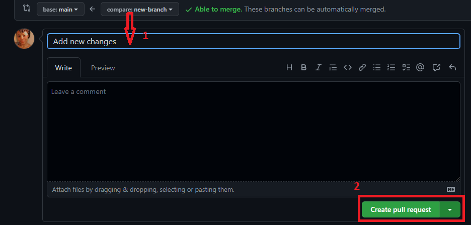
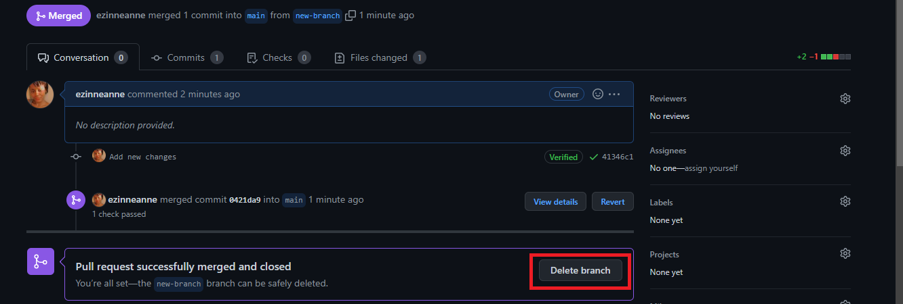

## Introduction to GitHub

## The table of content

- [Introduction to GitHub](#introduction-to-github)
- [The table of content](#the-table-of-content)
- [Introduction  <a name="Introduction"></a>](#introduction--)
  - [Prerequisites](#prerequisites)
- [What is GitHub?  <a name="What is GitHub?"></a>](#what-is-github--)
- [Why GitHub  <a name="Why GitHub"></a>](#why-github--)
- [Git vs. GitHub  <a name="GitGitHub"></a>](#git-vs-github--)
- [Clone (how to do cloning)  <a name="Clone"></a>](#clone-how-to-do-cloning--)
- [Commit (how to do a commit)  <a name="Commit"></a>](#commit-how-to-do-a-commit--)
- [Pull request (how to do a pull request)  <a name="Pull request"></a>](#pull-request-how-to-do-a-pull-request--)
- [GitHub Desktop vs. GitHub CLI  <a name="DesktopCLI"></a>](#github-desktop-vs-github-cli--)
- [Conclusion  <a name="conclusion"></a>](#conclusion--)


## Introduction  <a name="Introduction"></a>


Software engineers use a distributed system like git to store code, review and collaborate with other engineers. Git is a version control system that is used in software companies and by individuals in the technological space. They use the application GitHub as a platform to carry out git activities.
In this article, we are going to cover GitHub, why software engineers use GitHub, and compare git and GitHub, we will show how to clone, commit and make a pull request. Finally, we will compare the GitHub desktop with GitHub CLI.

### Prerequisites

- To complete this article, you will need a GitHub account.
- A text editor (preferably [vscode](https://code.visualstudio.com/download))
- A terminal (either the command prompt or [VS Code](https://code.visualstudio.com/download))
- Internet access

## What is GitHub?  <a name="What is GitHub?"></a>
GitHub is a cloud platform that uses git technology. The application is used by over 65 million developers around the world to build and ship products. They offer free and paid access to projects for developers to collaborate and keep track of changes.
GitHub provides access to git command-line tools, a desktop GUI and a web-based interface to clone, commit and push projects.

## Why GitHub  <a name="Why GitHub"></a>
There are other platforms that use git technology like Bitbucket, GitLab, Google Cloud Source Repositories, etc. But GitHub is the most popular among them. GitHub is beginner friendly, and engineers use it for open-source contribution which provides opportunities to contribute to the software. It has a large community of developers and there are many resources including answers on stack overflow.
We also use GitHub as a resume, hiring managers would likely hire developers with an active GitHub profile over others.
GitHub offers features that makes it easier for team members to work together


## Git vs. GitHub  <a name="GitGitHub"></a>  

| Git                                                      | GitHub                                                     |
| ---------------------------------                        | ---------------------                                      |
| It is a version control system                           |  It is platform that uses version control tools like git and SVN. |
| It is freely used                                        |  It offers both free and paid packages                      |
| It was created in 2005                                   |  It was created in 2008                                     |
| It is maintained by Linux                         |  Microsoft maintains it                                     |
|We can use on other apps like BitBucket, GitLab and so on.|  It cannot run without git                                  |
| We can install it locally on a local machine.            | We can access it via a web browser, install it locally on desktop and android and it offers a command-line tool. |

**Note:** In git, there are certain terminologies that are used and I will explain some of them here. 
A repository is a folder that houses an application you created on GitHub. (Also known as a repo)

## Cloning  <a name="Clone"></a>
First, we will create an application on GitHub and make some changes to that application. Then we will send it back.
To do that, you must own a GitHub account. If you don't have one, then you can [create one here](https://github.com/join). 

After that, we will create a repository. Go to your GitHub account and click on `Repositories`


When you click on it, click on `New`


Then give your repository a name. I will name mine `github-tutorial`. I will give it a brief description(this is optional though). I will leave it on public.


Leave the remaining details blank and click on `create a repository`


Now, I will clone the repository to make some changes on my device. Cloning means creating a copy of that application in your local device.

To clone the repo, go to the green button written `"code"`. Click on it and copy the link.


Open the command prompt terminal on your local device or you can use the terminal in vscode. I will use the terminal in my vscode. Click this [link to install vscode](https://code.visualstudio.com/download), if you wish to use it and it is not installed on your device.

After it has opened, enter this:

Syntax:
```
git clone "the link you copied"

```

Command:
```
git clone 'https://github.com/ezinneanne/github-tutorial.git'

```


That will create the folder in your local device.
As you can see, the folder is already showing on my local device.

To make the changes, I will `CD` to the folder, `github-tutorial`.

Syntax:
```
cd the repo you cloned
```

Command:
```
cd github-tutorial
```

Create a new branch,

```
git checkout -b "new-branch"
```

This will create a new branch on the repository.


Then, I will open my GitHub `README.md` on vscode text editor and make some changes.


And enter `git status ` afterwards.

This is a git command that shows you the current level of operations, detailing what you have done on the repository and what you need to do.


If you are following this tutorial, when you enter that command, you will see that we have not staged the changes for commit. 


## Making a Commit  <a name="Commit"></a>
When we have cloned the repo and made the changes. Then, we will need to stage the changes with `git add.`
So enter, `git add .`  (don't forget to add the dot)

After that, we will sign our changes, you sign the changes by using `git commit -m "Add new changes"`. This means taking a snapshot of the changes you made. 


Then make a commit, that will sign the changes we made. The next thing would be to push it back to your repository online.


Enter :

```
git push –u origin "new-branch"
```

This will move the changes to your repo on GitHub.


## Pull request  <a name="Pull request"></a>
Open your GitHub account and you will see something like this.


This is where pull requests come in. In this repo, we have made some changes and those changes are not into the main branch. So GitHub is asking us to make a pull request. Which is submitting those changes we have made to the main branch.

Now, click on the `compare & pull request` button


Add descriptive text in the comment box and click on `create pull request`



The next option is to merge the pull request. When we will click on the merge pull request, we will end up adding the changes to the main branch.





You can delete the branch you used. With that, you have made your first pull request. You will make more pull requests as you start open source or when you get a job in tech. There are some tools you could use to improve your productivity on GitHub. The activity we did was using the GitHub browser and a terminal. But with time, you would need to use either GitHub Desktop or the CLI.


## GitHub Desktop vs. GitHub CLI  <a name="DesktopCLI"></a>


The image above is GitHub desktop, you can run this application on your local device without using a web browser. It provides access to some git commands like cloning, making a pull request or making a commit and other features that promote collaboration.

  

This is GitHub CLI, with this tool, you can access all the gitHub features on your local device and it works just like a terminal. 

Let us look at some of the differences between GitHub Desktop and GitHub CLI:

| GitHub  Desktop            | GitHub CLI                   |
| -------------------------- | ---------------------------- |
| It uses a Graphic User Interface (GUI)   | It allows to run git and github activities on the command-line |
| It is easier to learn      | It requires more time to learn and master it |
| It is not helpful in debugging | It is helpful in debugging and solving [merge conflicts](https://docs.github.com/en/pull-requests/collaborating-with-pull-requests/addressing-merge-conflicts/resolving-a-merge-conflict-using-the-command-line) |
| You cannot create extensions on it| You can create extensions  |
| It does not offer access to all git features | It offers access to every git feature |

For more information on how to use the GitHub desktop, [check this guide](https://docs.github.com/en/desktop) and this [guide for the GitHub cli](https://docs.github.com/en/github-cli)

## Conclusion  <a name="conclusion"></a>
By the end of this article, you have learned what GitHub is, why we use GitHub, and compared git with GitHub. We used an example to illustrate how to clone, commit and make a pull request. Finally, we explained GitHub desktop and GitHub CLI.
You can start contributing to open-source projects on GitHub. Need a guide to begin open source, [check this article](https://www.freecodecamp.org/news/how-to-contribute-to-open-source-projects-beginners-guide/)