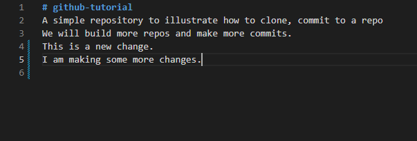
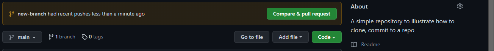

## Introduction to GitHub

## The table of content

- [Introduction to GitHub](#introduction-to-github)
- [The table of content](#the-table-of-content)
- [Introduction  <a name="Introduction"></a>](#introduction--)
  - [Prerequisites](#prerequisites)
- [What is GitHub?  <a name="What is GitHub?"></a>](#what-is-github--)
- [Why GitHub  <a name="Why GitHub"></a>](#why-github--)
- [Git vs. GitHub  <a name="GitGitHub"></a>](#git-vs-github--)
- [Clone (how to do cloning)  <a name="Clone"></a>](#clone-how-to-do-cloning--)
- [Commit (how to do a commit)  <a name="Commit"></a>](#commit-how-to-do-a-commit--)
- [Pull request (how to do a pull request)  <a name="Pull request"></a>](#pull-request-how-to-do-a-pull-request--)
- [GitHub Desktop vs. GitHub CLI  <a name="DesktopCLI"></a>](#github-desktop-vs-github-cli--)
- [Conclusion  <a name="conclusion"></a>](#conclusion--)


## Introduction  <a name="Introduction"></a>


In software engineering, engineers use a distributed system like git to store code, review and collaborate with other engineers. Git is a version control system that is used in software companies and by individuals in the technological space. Software engineers use the application GitHub as a platform to carry out git activities.
In this article, we are going to cover GitHub, why GitHub, and compare git and GitHub, we will use an example to illustrate how to clone, commit and make a pull request. Finally, we will compare the GitHub desktop with GitHub CLI.

### Prerequisites

- To complete this article, you will need a GitHub account.

- Internet access

## What is GitHub?  <a name="What is GitHub?"></a>
GitHub is a cloud platform that uses git technology used by over 65 million developers around the world to build and ship products. They offer free and paid access to projects for developers to collaborate and keep track of changes.
GitHub provides access to git command-line tools, and a web-based interface to clone, commit and push projects.

## Why GitHub  <a name="Why GitHub"></a>
There are other platforms that use git technology like Bitbucket, GitLab, Google Cloud Source Repositories, etc. But GitHub is the most popular among them. GitHub is beginner friendly, and we use it for open-source contribution which provides opportunities for developers to contribute to the software. It has a large community of developers and there are many resources including answers on stack overflow.
We also use GitHub as a resume, hiring managers would likely hire developers with an active GitHub profile over others.


## Git vs. GitHub  <a name="GitGitHub"></a>
Git is a version control system that is used to build applications and keep track of changes. 
Git is free open-source software that was created in 2005. 

GitHub is a platform where you can carry out git activities.
GitHub is a profit-oriented company created in 2008 that offers free and paid plans to individuals and organisations.
As the name implies, it is a community that promotes collaboration among developers. 

| Git                        | GitHub                       |
| -------------------------- | ---------------------------- |
| It is maintained by Julio Hamano | Microsoft maintains it                        |
| We can use it for collaboration using other apps like BitBucket, GitLab and so on.                  | It cannot run without git                         |
| We can install it locally on a local machine. | We can access it via a web browser, install it locally on desktop and android and it offers a command-line tool. |


## Clone (how to do cloning)  <a name="Clone"></a>
In git, there are certain terminologies that are used and I will explain some of them here. 
A repository is a folder that houses an application you created on GitHub. (Also known as a repo)
First, we will create an application on GitHub and make some changes to that application. Then we will send it back.
To do that, you must own a GitHub account. If you don't have one, then you can [create one here](https://github.com/join). 

After that, we will create a repository. For this tutorial, I will create a repository which I will name `github-tutorial`. I will clone it to make some changes on my device. Cloning means creating a copy of that application in your local device.

To clone the repo, go to the green button written `"code"`. Click on it and copy the link.


Open the terminal on your local device. I will use the terminal in my vscode.

After it has opened, enter this:

```
git clone "the link you copied"

```


That will create the folder in your local device.
As you can see, the folder is already showing on my local device.

To make the changes, I will `CD` to the folder, `github-tutorial`.
Create a new branch,

```
git checkout -b "new-branch"
```

This will create a new branch on the repository, so I can make changes to it.

Then, I will open my GitHub `README.md` and make some changes.




After making the changes, enter git status.

This is a git command that shows you the current level of operations, detailing what you have done and what you need to do.


If you are following this tutorial, when you enter that command, you see that we have not staged the changes for commit. 


## Commit (how to do a commit)  <a name="Commit"></a>
After we have cloned the repo and made the changes. Then, we will need to stage the changes with git add.
So enter, `git add .`

After that, we will sign our changes, you sign the changes by using `git commit -m "Add new changes"`. This means taking a snapshot of the changes you made. 


Then make a commit, that will sign the changes we made. The next thing would be to push it back to your repository online.


Enter :

```
git push –u origin "new-branch"
```

This will move the changes to your repo on GitHub.

Open your GitHub account and you will see something like this.




## Pull request (how to do a pull request)  <a name="Pull request"></a>
This is where pull requests come in. In this repo, we have made some changes and those changes are not into the main branch. So GitHub is asking us to make a pull request. Which is submitting those changes we have made to the main branch.


After creating the pull request, the next option is to merge the pull request. When we will click on the merge pull request, we will end up adding the changes to the main branch.


After the merge, you can delete the branch you used. With that, you have made your first pull request. You will make more pull requests as you start open source or when you get a job in tech. There are some tools you could use to improve your productivity on GitHub. The activity we did was using the GitHub browser and a terminal. But with time, you would need to use either GitHub Desktop or the CLI.


## GitHub Desktop vs. GitHub CLI  <a name="DesktopCLI"></a>


GitHub Desktop is a GitHub application that can run on your desktop where you can run git operations, like forking, cloning, committing and making pull requests. It uses a GUI interface. It is easier to learn and use because of the smooth interface. 

While,


GitHub CLI uses a command-line interface to run git activities. It offers access to every git feature. Unlike the desktop, it is customizable as you add certain add-ons to enhance. It is also helpful in debugging and solving [merge conflicts](https://docs.github.com/en/pull-requests/collaborating-with-pull-requests/addressing-merge-conflicts/resolving-a-merge-conflict-using-the-command-line).


## Conclusion  <a name="conclusion"></a>
By the end of this article, you have learned what GitHub is, why we use GitHub, and compared git and GitHub. We use an example to illustrate how to clone, commit and make a pull request. Finally, we explained GitHub desktop and GitHub CLI.
If you can start contributing to open-source projects. Need a guide to begin open source, [check this article]